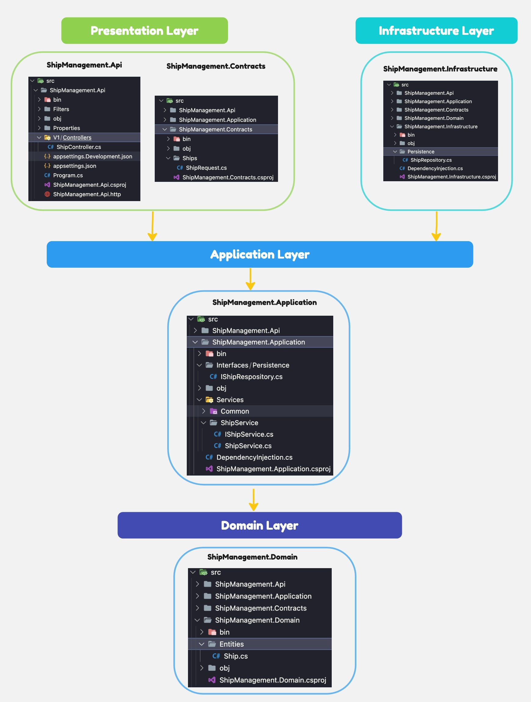
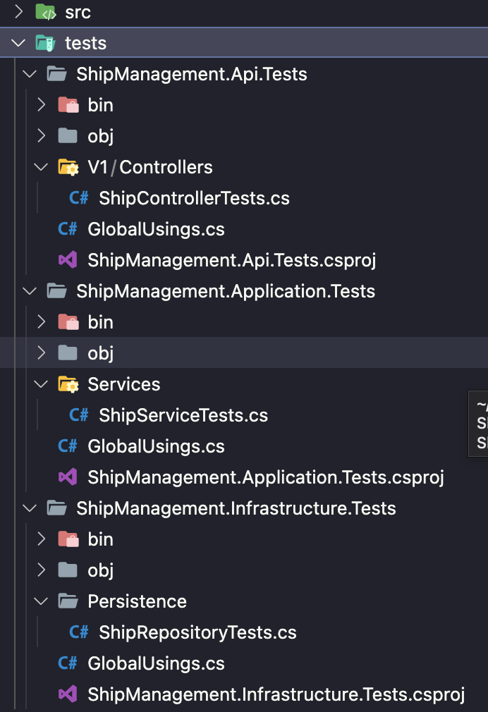

# SHIP MANAGEMENT API SERVICE (Version 1.0)

Robust ASP.NET Core Web API Service for CRUD Operations with Clean Architecture and Unit Testing.

## Table of Contents

- [Getting Started](#getting-started)
  - [Installation](#installation)
  - [Packages](#packages)
  - [Running the Application](#running-the-application)
- [API Documentation](#api-documentation)
- [Folder Structure](#folder-structure)

## Getting Started

Ship Management System using ASP.NET Core Web API (.net8). This service will allow basic operations (Create, Read, Update, Delete) for ships. Each ship is defined by a name, length (in meters), width (in meters), and a unique code

### Installation

#### Clone the repository:

Open your terminal or command prompt, go to the desired directory, and use the following command to clone the .NET Core Web API project:

```
git clone https://github.com/maheshpeechamkoli/ship-management-service.git
cd ship-management-service
```

### Running the Application using Docker

```
docker-compose build
docker compose up
```

Open the swagger URL

```
http://localhost:5148/swagger/index.html
```

Or

```
 . Install RESTClient VSCode extension
 . request/Ship/ShipApiRequest.http
```

### Running the Application with the .NET CLI

1. Downlaod .NET Core SDK for Windows

```
https://dotnet.microsoft.com/download
```

2. .NET Core SDK CLI for Mac

```
brew install --cask dotnet-sdk
```

##### Navigate to root directory

```
dotnet build
```

Run your .NET Core Web API using the following command:

```
cd .\src\ShipManagement.Api\
```

```
dotnet run
```

or

```
dotnet watch run
```

Run your .NET Core Test project using the following command:

```
cd .\tests\ShipManagement.Api.Tests\

or

cd .\tests\ShipManagement.Application.Tests\

or

cd .\tests\ShipManagement.Infrasructure.Tests\

```

```
dotnet test
```

### Packages

#### Project - version details

    1. net8.0
    2. Swashbuckle.AspNetCore 6.4.0
    3. AspNetCore.OpenApi 8.0.0
    4. AspNetCore.Mvc.Versioning 5.1.0

#### Unit Test - version details

    1. NET.Test.Sdk 17.6.0
    2. xunit 2.4.2
    3. xunit.runner.visualstudio 2.4.5
    4. AutoFixture 4.18.1
    5. FluentAssertions 6.12.0
    6. Moq 4.20.70

## API Documentation

### Crete API

#### Request Body

```
POST  {{host}}/ship/create
Content-Type: application/json

{
  "name":"LongShip",
  "length": 101,
  "width": 202,
  "code": "AAAA-1234-E5"
}
```

#### Response Body

Status Code : 200

```
{
  "success": true,
  "message": "Ship created successfully"
}
```

### List API

#### Request Body

```
GET  {{host}}/ship/list
Content-Type: application/json
```

#### Response Body

Status Code : 200

```
[
  {
    "id": "c56268a5-661e-418f-9b27-4be0e424c6d5",
    "name": "LongShip",
    "length": 101,
    "width": 202,
    "code": "AAAA-1234-E5"
  }
]
```

### Update API

#### Request Body

```
PUT  {{host}}/ship/update/{Id}
Content-Type: application/json
```

```
{
    "name": "WhiteShip",
    "length": 120,
    "width": 122,
    "code": "AAAA-1111-A1"
}
```

#### Response Body

Status Code : 200

```
{
  "success": true,
  "message": "Ship updated successfully"
}
```

### Delete API

#### Request Body

```
DELETE  {{host}}/ship/delete/{id}
Content-Type: application/json
```

#### Response Body

Status Code : 200

```
{
  "success": true,
  "message": "Ship deleted successfully"
}
```

## Folder Structure

### --src



### --tests



### Thank you
